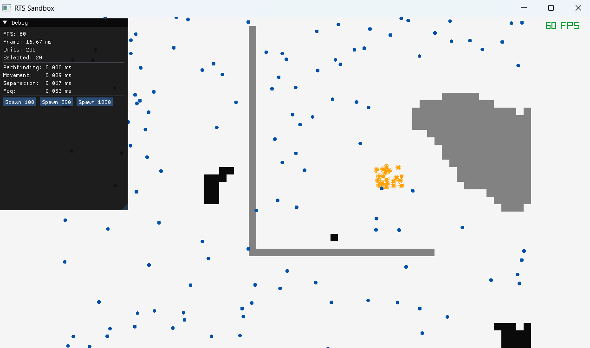
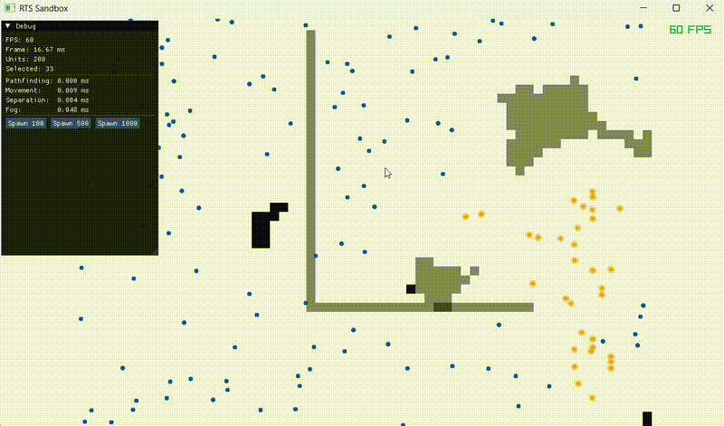

# RTS Sandbox

A small real-time strategy sandbox written from scratch in C++20, using [raylib](https://www.raylib.com/) for rendering and [Dear ImGui](https://github.com/ocornut/imgui) for the debug tools.

I worked with Raylib before however, I hadn't worked on an RTS before, so I built one to learn how the core systems actually work: selecting units, moving them around obstacles, keeping them in formation, and making the whole thing hold up when there are a few thousand units on the map. It's a tech demo, not a game. There's no win condition or enemy AI. The point is the systems underneath.

Everything here is hand written. The entity system, the pathfinding, the formations, the fog of war, none of it comes from an engine or a library. That was the whole idea, to understand the machinery by building it.



## What it does



- **Unit selection.** Drag a box to select a group, click to pick one, hold shift to add to the selection.
- **Movement orders.** Right click to send the selected units somewhere.
- **A\* pathfinding.** Units route around walls instead of walking through them, on a grid.
- **Formations.** A group spreads into a grid shape at the destination instead of piling onto one point, and each unit is matched to its nearest slot so they don't cross over each other.
- **Local avoidance.** Units push apart so they don't stack on top of one another.
- **Fog of war.** The map starts dark and units reveal a circle around themselves as they move. Areas you've seen go dim, areas no one can currently see stay hidden.
- **Live debug panel.** FPS, frame time, unit count, per system timings, and buttons to spawn 100 / 500 / 1000 units on the fly.
- **Camera.** Pan with WASD, zoom with the mouse wheel, F11 for fullscreen.

## How it's built

### Entity Component System

The core is a custom sparse set ECS. Instead of modelling a unit as one big class with all its data inside, each kind of data (position, velocity, health, selection state and so on) lives in its own tightly packed array, and an entity is just an id that ties them together.

The reason for this is cache efficiency. When a system only needs position and velocity, like the movement code does, it walks two contiguous arrays and every byte the CPU pulls into cache is a byte it actually uses. With a big class approach, iterating units would drag health, selection flags and everything else into cache too, wasting most of it. At a handful of units it makes no difference. At a few thousand, every frame, it's the difference between smooth and not.

The sparse set itself is the standard trick for this. A packed dense array holds the data, a sparse array maps an entity id to its slot in the dense array for O(1) lookup, and removal uses swap and pop so the dense array never grows holes. Entities use a generation counter packed into the id, so a recycled slot doesn't make old handles silently point at the wrong unit.

### Pathfinding

Grid based A\* with 8 directional movement and an octile distance heuristic. A couple of details took some iteration:

- **Obstacle inflation.** A\* treats a unit as a point, but units have a body, so a path that hugs a wall makes the unit clip the corner and get stuck. Pathfinding runs on a copy of the grid where walls are fattened by roughly a unit radius, so paths keep clearance. The thin walls are still what gets drawn, so the player sees normal walls while the pathfinder sees slightly bigger ones.
- **Nearest open cell retargeting.** Clicking right next to a wall used to land the goal inside the inflated zone, which A\* sees as blocked, so units just refused to move. Now if the goal is blocked it spirals outward to the closest open cell, so clicking near a wall still sends units as close as they can safely get.

### Formations

When a group is ordered to a point, it lays out a grid of slots centered on the click, then matches units to slots greedily by nearest distance. Greedy isn't mathematically optimal, but it's cheap and it stops units crossing the whole formation to reach a far off slot. Each unit then pathfinds to its own slot, which reuses the A\* above unchanged.

### Fog of war

Three states per cell: hidden, explored, visible. Each frame, everything currently visible drops back to explored, then every unit re lights the cells within its vision radius. That demote then recompute step is what makes the bright circle follow the units around and leave a dimmed trail behind. There are no enemies yet, so explored versus visible is mostly cosmetic here, but it's the correct model and enemy units would slot straight into it.

## Performance

The simulation is CPU bound. It draws flat 2D shapes, so the GPU is never the bottleneck. Pathfinding and per unit updates are. To find where the time actually went I built a small benchmark harness that runs each system in isolation, with no rendering and no input, at fixed unit counts and averages over a few hundred frames.

The first thing it surfaced was that unit separation was O(n²). It compared every unit against every other unit, so each time the unit count doubled, its cost quadrupled. At 4000 units it alone ate about 7ms of the 16.6ms frame budget.


The fix was a spatial hash grid. A unit can only push another unit that's within about 18 world units of it, so checking it against units on the far side of the map is wasted work. Bucketing units into coarse cells and only comparing against the 9 surrounding buckets turns the all pairs check into "check the handful nearby", which takes it from O(n²) down to roughly O(n).

Separation cost, before and after, measured in a RelWithDebInfo build (single threaded, Intel CPU):

| Units | Before (O(n²)) | After (spatial hash) | Speedup |
|------:|---------------:|---------------------:|--------:|
|   500 |       0.11 ms  |             0.07 ms  |   1.6x  |
|  1000 |       0.46 ms  |             0.21 ms  |   2.2x  |
|  2000 |       1.80 ms  |             0.51 ms  |   3.5x  |
|  4000 |       7.00 ms  |             1.07 ms  |   6.5x  |

The interesting part isn't the raw numbers, it's the shape. Before, separation quadrupled per doubling. After, it roughly doubles, which is the same scaling as the other linear systems. The speedup also grows with load, from 1.6x at 500 units to 6.5x at 4000, which is exactly what you'd expect from removing a quadratic term: the bigger the problem, the more it pays off.

You can reproduce the table with:

```
./build/rts.exe --bench
```

## Building

Needs a C++20 compiler and CMake (3.21 or newer). raylib, Dear ImGui and the rlImGui binding are pulled automatically through CMake's `FetchContent`, so there's nothing to install by hand.

```
cmake -B build -G Ninja -DCMAKE_BUILD_TYPE=RelWithDebInfo
cmake --build build
./build/rts.exe
```

Built and tested with MinGW-w64 GCC on Windows. The first configure takes a minute or two while it clones and compiles the dependencies. After that, builds are fast.

## Controls

| Action | Input |
|---|---|
| Select (box) | left click drag |
| Select (single) | left click |
| Add to selection | shift + click or drag |
| Move order | right click |
| Pan camera | WASD |
| Zoom | mouse wheel |
| Fullscreen | F11 |

## Project layout

```
src/
  ecs/         entity system: entities, sparse set, registry, components
  world/       grid and A* pathfinding
  systems/     selection, orders, movement, separation, fog, rendering
  debug/       profiler and ImGui panel
  bench/       the benchmark harness
```

## What I'd do next

A few things I deliberately left out of scope, in rough priority order:

- **Console and proprietary engine concerns.** This is pure desktop and rolls its own engine. The obvious next step is mapping these ideas onto a real production toolchain.
- **Multithreaded pathfinding.** A\* requests are independent, so they'd parallelize well across a job system.
- **Smarter separation.** Proper steering so units flow around each other in transit rather than just being pushed apart.
- **Deterministic, fixed timestep simulation.** Needed for replays and the foundation of any networked RTS.
